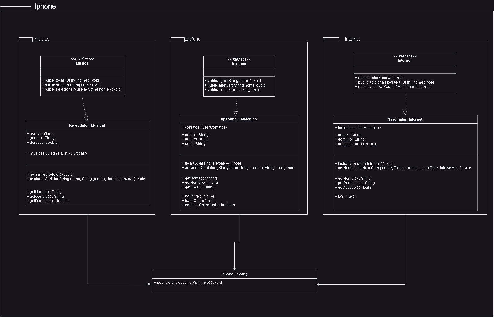

# Pratica_UML_Iphone
>Neste repositório desenvolvi uma diagramação UML e a implementação em código desse diagrama no java. A atividade consiste em simular algumas funcionalidades do Iphone com base nos conhecimentos de POO e fazer uma representação visual com o UML, com base <a href="https://www.youtube.com/watch?v=9ou608QQRq8">nesse video</a> referente a apresentação do iphone 7 feita pelo steve jobs

## Classes
- Navegador_Internet
- Reprodutor_Musical
- Aparelho_Telefonico

## Interfaces
- Internet_Interface
- Musica_Interface
- Telefone_Interface

## classe main 
- Iphone

## Diagrama UML

